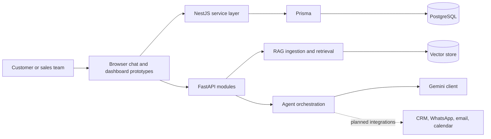

# MRStay AI

An in-development **agentic real-estate sales platform** for Mooncee. The project brings together a customer chat experience, lead qualification, property knowledge retrieval, AI-assisted responses, and the foundations for sales-team workflows.

> [!NOTE]
> MRStay AI is an active engineering foundation, not a production-ready public service. The repository contains TypeScript/NestJS, Python/FastAPI, RAG, and prototype frontend components that are still being integrated and hardened.

## Product direction

The intended experience is a reception agent that understands a buyer's intent, retrieves grounded property information, qualifies leads, and routes the conversation or task to the right specialist workflow.

## Architecture



The repository currently contains two implementation paths: a NestJS service with Prisma support and Python modules for the agent/RAG layer. They share a product direction but should be treated as evolving components until their interfaces are consolidated.

## What is in the repository

- Lead, property, chat, health, RAG, and agent API modules.
- Sales, reception, property, marketing, follow-up, and lead-qualification agent scaffolding.
- Knowledge-base ingestion, chunking, embeddings, retrieval, and prompt-building modules.
- Property documents and sample knowledge data.
- A plain HTML/CSS/JavaScript chat prototype plus an engineering-dashboard prototype.
- NestJS tests, Python checks, project docs, contribution guidance, and a changelog.

## Technology

| Area | Current technology |
| --- | --- |
| TypeScript service | NestJS, Prisma, Jest |
| Python service modules | FastAPI, Uvicorn, Pydantic |
| AI and retrieval | Gemini client, local RAG modules, ChromaDB path configuration |
| Data | PostgreSQL and local property/knowledge documents |
| Browser prototypes | HTML, CSS, JavaScript |

## Project structure

```text
src/
  ai/               # Agents, workflows, memory, LLM client
  backend/           # FastAPI routes, services, models, RAG helpers
  frontend/          # Browser chat prototype
  rag/               # Ingestion and retrieval modules
  database/          # Connection helpers and schema material
prisma/              # Prisma configuration
docs/                # Product and engineering documentation
tests/ and test/     # Automated and exploratory checks
```

## Local setup

Prerequisites: Node.js 20+, Python 3.11+, and a PostgreSQL instance for database-backed flows.

```bash
git clone https://github.com/Cod4Nitish/MRStay_AI.git
cd MRStay_AI

# macOS/Linux
cp .env.example .env

# Windows PowerShell
Copy-Item .env.example .env

npm ci
python -m venv .venv
```

Activate the virtual environment, then install the Python dependencies:

```bash
# macOS/Linux
source .venv/bin/activate

# Windows PowerShell
.venv\\Scripts\\Activate.ps1

pip install -r requirements.txt
```

Set the values in `.env` before starting a service. Use your own database and Gemini credentials; never commit them.

### Environment variables

| Variable | Purpose |
| --- | --- |
| `ENVIRONMENT` | Runtime mode, such as `development` |
| `PROJECT_NAME` | Project label used by the app |
| `DATABASE_URL` | PostgreSQL connection URL for local development |
| `GEMINI_API_KEY` | Gemini API credential for AI-enabled flows |
| `CHROMA_DB_PATH` | Local vector-store path |
| `WHATSAPP_API_KEY` | Reserved for a future integration |

## Run and verify

Start the NestJS development service:

```bash
npm run start:dev
```

Run the TypeScript checks:

```bash
npm run build
npm run test
npm run test:e2e
```

The Python/FastAPI modules are organised under `src/backend/`; follow the module-level READMEs and run only the service path you are actively developing. The browser prototype in `src/frontend/` can be served by any static HTTP server.

## Security

- `.env.example` contains placeholders only; use `.env` for local secrets.
- Rotate any credential that was previously committed, even if it has since been removed from the working tree.
- Do not expose property documents, customer data, or Gemini/database credentials in demos or pull requests.

## Documentation

- [Docs index](docs/README.md)
- [AI layer](src/ai/README.md)
- [Backend layer](src/backend/README.md)
- [RAG layer](src/rag/README.md)
- [Contributing](CONTRIBUTING.md)

## License

See [LICENSE](LICENSE).
