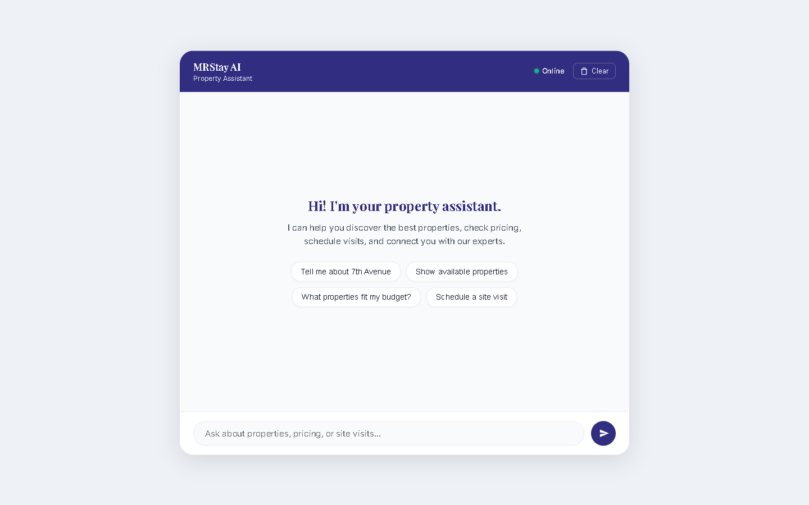
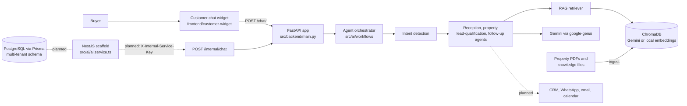

# MRStay AI

An in-development **agentic real-estate sales platform** for Mooncee. A buyer chats with a property assistant; a FastAPI service detects intent, routes the message to a specialist agent, grounds answers in a property knowledge base, and flags qualified leads.

> [!NOTE]
> MRStay AI is an active engineering foundation, not a production-ready public service. The Python/FastAPI agent and RAG path is the working core. The NestJS service is still a scaffold, several API modules return placeholder data, and the engineering dashboard is a local prototype. See [Current status](#current-status).



<sub>The customer chat widget served locally, before a conversation starts. No backend was connected for this screenshot.</sub>

## Product direction

The intended experience is a reception agent that understands a buyer's intent, retrieves grounded property information, qualifies leads, and hands the conversation to the right specialist workflow or sales team member.

## Architecture



- **FastAPI service** (`src/backend/`): the running API. It mounts the chat, RAG, Gemini, health, and internal-chat routers.
- **Agent layer** (`src/ai/`): intent detection plus reception, property, lead-qualification, follow-up, marketing, and sales-manager agents, coordinated by `AgentOrchestrator`, with in-memory session storage.
- **RAG layer** (`src/backend/rag/`, `src/rag/`): PDF loading, chunking, embeddings (Gemini by default, or local sentence-transformers), ChromaDB storage, retrieval, and prompt building.
- **NestJS service** (`src/`): a Nest application with a Prisma schema and an `AiService` client for `/internal/chat`. The `AiService` is not yet registered in `AppModule`, so the Nest app currently serves only its default route.

## Current status

| Area | Status |
| --- | --- |
| `POST /chat/` agent conversation | Implemented: intent routing, RAG grounding, Gemini responses, session IDs |
| `/api/rag/query`, `/api/rag/ingest`, `/api/rag/stats` | Implemented |
| `POST /internal/chat` | Implemented; requires `INTERNAL_SERVICE_KEY` |
| `/api/gemini/test`, `/api/gemini/chat` | Implemented; **falls back to a keyword-based mock** and reports `"provider": "Mock AI"` when Gemini is unavailable |
| `/lead/`, `/property/`, `/api/agent/status`, `/api/system/*` | **Placeholders**: status messages or hard-coded example values |
| Prisma multi-tenant schema (tenants, users, API keys, widgets, conversations, leads, subscriptions, usage) | Schema and initial migration only; not yet used by an API |
| Customer chat widget (`frontend/customer-widget/`) | Working client for `POST /chat/` |
| Engineering dashboard (`frontend/engineering-dashboard/`) | Local prototype: browser-only demo login and `localStorage` data |
| CRM, WhatsApp, email, calendar integrations | Planned |

## Technology

| Area | Current technology |
| --- | --- |
| API and agents | Python, FastAPI, Uvicorn, Pydantic |
| AI and retrieval | Gemini (`google-genai`) for generation and default embeddings, optional sentence-transformers embeddings, ChromaDB, LangChain text splitters, pypdf |
| TypeScript service | NestJS, Prisma, Jest (scaffold) |
| Data | PostgreSQL schema via Prisma; local property documents |
| Browser clients | HTML, CSS, JavaScript |

## Project structure

```text
src/
  backend/            # FastAPI app: main.py, api/ routers, rag/, services/, middleware/
    data/documents/   # Property brochures and knowledge files used for ingestion
  ai/                 # Agents, orchestrator, memory, Gemini client, NestJS AiService
  rag/                # Ingestion and retrieval modules
  database/           # SQLAlchemy connection helpers
  frontend/           # Earlier static chat prototype
  main.ts, app.*.ts   # NestJS entry point and default module
frontend/
  customer-widget/        # Buyer-facing chat widget (calls the FastAPI /chat/ endpoint)
  engineering-dashboard/  # Internal progress dashboard prototype
prisma/               # Multi-tenant schema and initial migration
docs/                 # Product and engineering documentation
test/                 # NestJS e2e test
tests/                # Placeholder folders for Python unit/integration/API tests
```

## Local setup

Prerequisites: Node.js 20+, Python 3.11+, and a [Gemini API key](https://aistudio.google.com/apikey). PostgreSQL is only needed for Prisma work.

```bash
git clone https://github.com/Cod4Nitish/MRStay_AI.git
cd MRStay_AI

# macOS/Linux
cp .env.example .env
python -m venv .venv
source .venv/bin/activate

# Windows PowerShell
Copy-Item .env.example .env
python -m venv .venv
.venv\Scripts\Activate.ps1

pip install -r requirements.txt
npm ci
```

Set the values in `.env` before starting a service. Use your own credentials and never commit `.env`.

> [!NOTE]
> The Gemini service lists available models when it is imported, so the FastAPI app needs a valid `GEMINI_API_KEY` and network access to start.

### Environment variables

| Variable | Used by | Purpose |
| --- | --- | --- |
| `ENVIRONMENT` | FastAPI | Runtime mode, such as `development` |
| `PROJECT_NAME` | FastAPI | Project label |
| `GEMINI_API_KEY` | FastAPI | Gemini API credential |
| `CHROMA_DB_PATH` | FastAPI | Local vector-store directory |
| `EMBEDDING_PROVIDER` | FastAPI | Optional: `gemini` (default) or `local` for sentence-transformers |
| `DATABASE_URL` | Prisma, SQLAlchemy | PostgreSQL connection URL |
| `AI_SERVICE_URL` | NestJS | FastAPI base URL for `AiService` |
| `INTERNAL_SERVICE_KEY` | FastAPI, NestJS | Shared secret for `/internal/chat`; the endpoint returns 503 until it is set |
| `WHATSAPP_API_KEY` | none yet | Reserved for a future integration |

## Run the demo path

1. **Build the knowledge base** from the documents in `src/backend/data/documents/`:

   ```bash
   python -m src.backend.rag.ingest
   ```

2. **Start the API** from the repository root. Imports use the `src.` package path, so run it from the root:

   ```bash
   uvicorn src.backend.main:app --reload --port 8000
   ```

   Interactive API docs are then available at `http://127.0.0.1:8000/docs`.

3. **Open the chat widget.** It calls `http://127.0.0.1:8000/chat/`, and CORS allows port 5500:

   ```bash
   python -m http.server 5500 --directory frontend
   ```

   Visit `http://127.0.0.1:5500/customer-widget/` and ask about a property, such as "Tell me about 7th Avenue".

The NestJS app can be started separately with `npm run start:dev`; it currently serves only its default route.

## Tests and checks

```bash
npm run lint       # ESLint for the TypeScript code (runs with --fix)
npm run build      # NestJS build
npm run test       # Jest unit tests
npm run test:e2e   # NestJS e2e test
```

Python checks are limited for now: `tests/` contains placeholder folders, and `test_e2e.py` is an exploratory script that expects a running API.

## Security

- `.env.example` contains placeholders only; keep real values in `.env`, which is gitignored.
- `/internal/chat` fails closed: it rejects every call until `INTERNAL_SERVICE_KEY` is configured, then compares keys in constant time.
- The engineering dashboard's login is a **client-side demo gate**. Its example usernames and passwords ship in `frontend/engineering-dashboard/js/auth.js` and protect nothing on a server. Do not host the dashboard publicly or treat it as access control.
- A real database connection string was committed to `.env.example` in an earlier revision and remains in Git history. It has been replaced with a placeholder, and that database password must be rotated.
- Do not expose customer data or credentials in demos, issues, or pull requests.

## Documentation

- [Docs index](docs/README.md)
- [AI layer](src/ai/README.md)
- [Backend layer](src/backend/README.md)
- [RAG layer](src/rag/README.md)
- [Contributing](CONTRIBUTING.md)
- [Changelog](CHANGELOG.md)

## License

See [LICENSE](LICENSE).
