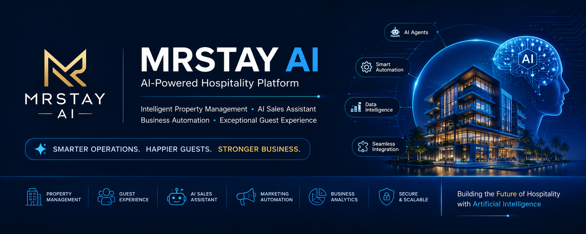

<p align="center">
  
</p> 
🏨 MRStay AI


<p align="center">
  <strong>AI-Powered Hospitality Platform</strong><br>
  Intelligent Property Management • AI Sales Assistant • Business Automation • Guest Experience
</p>

<p align="center">


</p>

---

# 📖 Overview

MRStay AI is an enterprise-grade AI platform designed to modernize hospitality operations through intelligent automation, conversational AI, and scalable software architecture.

The platform integrates AI agents, Retrieval-Augmented Generation (RAG), Large Language Models (LLMs), and business automation to simplify property management, improve guest experiences, and support sales operations.

---

# 🎯 Vision

To build the next generation of AI-powered hospitality software that enables businesses to operate smarter, faster, and more efficiently.

---

# 🚀 Core Features

- 🤖 AI Sales Assistant
- 🏨 Property Recommendation Engine
- 💬 AI Customer Support
- 📊 Analytics Dashboard
- 📚 Retrieval-Augmented Generation (RAG)
- 🧠 Conversational Memory
- 📅 Workflow Automation
- 📈 Lead Qualification
- 📧 Email Automation
- 📱 WhatsApp Integration

---

## 🏗️ System Architecture

Detailed architecture documentation will be added during development.
---

# 🛠️ Technology Stack

| Layer | Technology |
|---------|------------|
| Backend | FastAPI |
| Frontend | HTML • CSS • JavaScript |
| AI Framework | LangGraph |
| LLM | Google Gemini |
| Vector Database | ChromaDB |
| Database | PostgreSQL |
| Version Control | Git & GitHub |

---

# 📂 Repository Structure

```text
MRStay-AI/

backend/
frontend/
ai/
docs/
tests/
scripts/
infrastructure/

README.md
CONTRIBUTING.md
CODE_OF_CONDUCT.md
CHANGELOG.md
```

---

# 🚀 Getting Started

## Clone Repository

```bash
git clone https://github.com/<organization-or-username>/MRStay-AI.git
cd MRStay-AI
```

---

## Create Virtual Environment

### Windows

```bash
python -m venv .venv
.venv\Scripts\activate
```

### Linux / macOS

```bash
python3 -m venv .venv
source .venv/bin/activate
```

---

## Install Dependencies

```bash
pip install -r requirements.txt
```

---

## Configure Environment

```bash
cp .env.example .env
```

Update all required environment variables before starting the application.

---

## Run Backend

```bash
uvicorn backend.main:app --reload
```

Application:

```
http://127.0.0.1:8000
```

---

# 🔄 Development Workflow

Engineering Workflow:

Planning

↓

Development

↓

Unit Testing

↓

Bug Fixing

↓

Integration Testing

↓

Git Commit

↓

Pull Request

↓

Deployment

---

# 🤖 AI Workflow

```text
Customer
    │
    ▼
Reception Agent
    │
    ▼
Intent Detection
    │
    ▼
Agent Orchestrator
    │
    ▼
Property AI
Marketing AI
Lead AI
Support AI
    │
    ▼
Tool Manager
    │
    ▼
Gemini
    │
    ▼
ChromaDB
    │
    ▼
Response
```

# 📊 Project Status

| Module | Status |
|---------|--------|
| Backend | 🚧 In Progress |
| Frontend | 🚧 In Progress |
| AI Agents | 🚧 In Progress |
| RAG | 🚧 In Progress |
| Documentation | 🚧 In Progress |
| Testing | ⏳ Planned |
| Deployment | ⏳ Planned |

---

# 🗺️ Roadmap

### Phase 1
- Project Foundation
- GitHub Setup
- RAG
- ChromaDB
- FastAPI

### Phase 2
- AI Agents
- CRM Integration
- WhatsApp Integration
- Dashboard

### Phase 3
- Testing
- Deployment
- Monitoring
- CI/CD
---

# 📚 Documentation

Complete project documentation is available in:

```text
docs/
```

Includes:

- Architecture
- Development Guide
- API Documentation
- Deployment
- Testing
- Research
- Roadmap

---

# 🤝 Contributing

Please read:

```
CONTRIBUTING.md
```

before contributing.

Follow the established Git workflow, coding standards, and review process.

---

# 🔒 Security

Never commit:

- API Keys
- Passwords
- `.env`
- Database Dumps
- Secrets
- Credentials

---

# 📄 License

Private Repository

Internal Engineering Project

© MRStay AI. All Rights Reserved.
